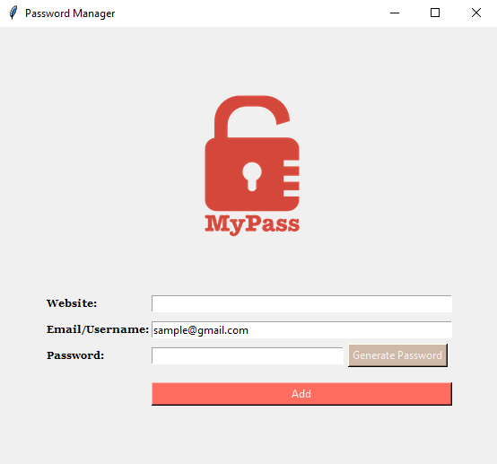

# Password Manager

Welcome to the Password Manager! This application helps you securely store and manage your passwords for different websites.

## Features
- Password Generator: Generate strong and random passwords for your accounts.
- Save Passwords: Store passwords along with the website and email/username.
- Secure Storage: Passwords are stored locally and encrypted for security.
- Easy to Use: Simple and intuitive user interface for managing passwords.

## How to Use
1. Enter the website, email/username, and password for the account.
2. Click on "Generate Password" to create a strong and random password.
3. Click on "Add" to save the password for the website.

## Installation
1. Clone the repository or download the files.
2. Install the required dependencies (Tkinter, pyperclip).
3. Run the `main.py` file using a Python interpreter.

## Screenshots

## Credits
- Developed by [Supun Wickramarachchi](https://github.com/supunwickramarachchi).
- Inspired by the need for a simple and secure password manager.

Enjoy using the Password Manager to keep your passwords safe and organized!
